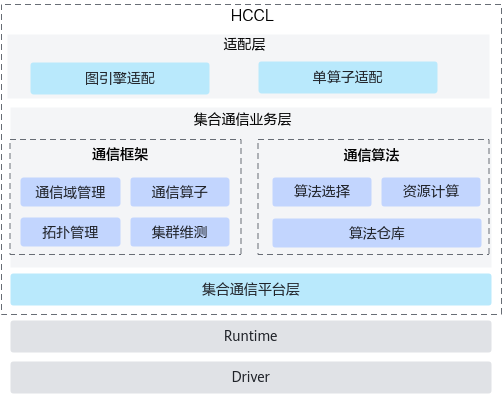
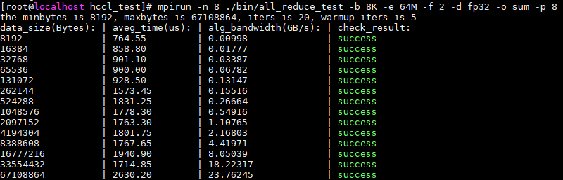

# cann-hccl

## 概述

集合通信库（Huawei Collective Communication Library，简称HCCL）是基于昇腾AI处理器的高性能集合通信库，提供单机多卡以及多机多卡间的数据并行、模型并行集合通信方案。

HCCL的软件架构如下图所示，分为“通信框架”、“通信算法”与“通信平台”三个模块，本源码仓中包含了其中紫色底纹所示的“**通信框架**”与“**通信算法**”两个模块的源码。




- 适配层，图引擎与单算子适配，进行通信切分寻优等操作。
- 集合通信业务层，包括通信框架与通信算法两个模块：
  - 通信框架：负责通信域管理，通信算子的业务串联，协同通信算法模块完成算法选择，协同通信平台模块完成资源申请并实现集合通信任务的下发。
  - 通信算法：作为集合通信算法的承载模块，提供特性集合通信操作的资源计算，并根据通信域信息完成通信任务编排。
- 集合通信平台层，提供NPU之上与集合通信关联的资源管理，并提供集合通信维测能力。

本源码仓提供了Mesh、Ring、Recursive Halving-Doubling（RHD）、PairWise四种拓扑算法的实现源码。

| 算法  | 描述  |原理与耗时   |
|---|---|---|
| Mesh | Server内通信算法，是Mesh互联拓扑的基础算法。  | [Mesh](docs/Mesh.md) |
| Ring  | Server内和Server间通信算法，是基于环结构的并行调度算法。<br> Server间通信场景下，适用于小规模节点数（<32机，且非2幂）和中大规模通信数据量（\>=256M）的场景。  | [Ring](docs/Ring.md)   |
| RHD | Server间通信算法，递归二分和倍增算法，当通信域内Server个数为2的整数次幂时，此算法具有较好的亲和性。  | [RHD](docs/RHD.md) |
|  Pairwise|Server间通信算法，比较算法，仅用于AllToAll与AlltoAllV算子，适用于数据量较小（<=1M \* RankSize）的场景。   | [PairWise](docs/PairWise.md)  |

HCCL采用α–β模型（Hockney）进行性能评估，算法耗时计算用到的变量定义如下：

-   α：节点间的固定时延。
-   β：每byte数据传输耗时。
-   n：节点间通信的数据大小，单位为byte。
-   γ：每byte数据规约计算耗时。
-   p：通信域节点个数，影响通信步数。
    
    其中单步传输并规约计算n byte数据的耗时为： D = α + nβ + nγ。


## 源码定制指南
开发者可以基于本源码仓中的源码进行通信算法与通信算子的定制开发，详细的定制开发指引文档及相关API说明文档可参见[HCCL源码定制开发指南](docs/hccl_customized_dev/README.md)。

## 目录结构说明

HCCL仓关键目录如下所示：

```
  ├── src                         # HCCL相关源代码
  |   ├── domain
  |   |   ├── collective_communication
  |   |   |   ├── algorithm       # 通信算法相关源代码
  |   |   |   ├── framework       # 通信框架相关源代码     
  ├── test                        # 预留测试代码目录
  ├── docs                        # 集合通信描述文档
  ├── inc                         # 集合通信对外头文件
  ├── build.sh                    # HCCL源码编译入口脚本                         
```

## 环境准备

HCCL支持源码编译，在源码编译前，请根据如下步骤完成相关环境准备。

1. 获取CANN开发套件包。
   
   请从[Link](https://www.hiascend.com/developer/download/community/result?module=cann)获取配套版本的CANN开发套件包`Ascend-cann-toolkit_<cann_version>_linux-<arch>.run`。
   
   - **本源码仓与CANN社区版本的配套关系可参见"[开放项目与CANN版本配套表](https://gitee.com/ascend/cann-community/blob/master/README.md#cannversionmap)"。**
   - 支持的操作系统请参见配套版本的[用户手册](https://hiascend.com/document/redirect/CannCommunityInstSoftware)中“支持的操作系统”章节。
   
2. 安装依赖
  
   以下所列仅为cann-hccl源码编译用到的依赖，其中python、gcc、cmake的安装方法请参见配套版本[用户手册](https://hiascend.com/document/redirect/CannCommunityInstDepend)的“安装依赖”章节。

   - python >= 3.7.0

   - gcc >= 7.3.0

   - cmake >= 3.16.0
   
   - nlohmann json头文件
   
     HCCL源码编译过程中涉及Json文件的解析，编译前需要参见如下步骤下载依赖的nlohmann json头文件。
   
     a. 单击[Link](https://github.com/nlohmann/json/releases/download/v3.11.2/include.zip)，下载nlohmann json的头文件压缩包`include.zip`。
   
     b. 解压缩`include.zip`。
     
        将`include.zip`解压缩到任意CANN开套件包安装用户具有读写权限的目录，并记录该目录位置，后续编译时会用到。
     
        例如：
     
        ```
        mkdir /home/nlohmann_json
        cp include.zip /home/nlohmann_json
        cd /home/nlohmann_json
        unzip include.zip
        ```
   
3. 安装CANN开发套件包。
   
   执行安装命令时，请确保安装用户对软件包具有可执行权限。
   - 使用默认路径安装
     ```shell
     ./Ascend-cann-toolkit_<soc_version>_linux_<arch>.run --install
     ```
     若使用root用户安装，安装完成后相关软件存储在`/usr/local/Ascend/ascend-toolkit/latest`路径下。

     若使用非root用户安装，安装完成后相关软件存储在`$HOME/Ascend/ascend-toolkit/latest`路径下。
   - 指定路径安装
     ```shell
     ./Ascend-cann-toolkit_<soc_version>_linux_<arch>.run --install --install-path=${install_path}
     ```
     安装完成后，相关软件存储在${install_path}指定路径下。

4. 设置环境变量。

   - 默认路径，root用户安装
     ```shell
     source /usr/local/Ascend/ascend-toolkit/set_env.sh
     ```
   - 默认路径，非root用户安装
     ```shell
     source $HOME/Ascend/ascend-toolkit/set_env.sh
     ```
   - 指定路径安装
     ```shell
     source ${install_path}/ascend-toolkit/set_env.sh
     ```
     **注意：若环境中已安装多个版本的CANN软件包，设置上述环境变量时，请确保${install_path}/ascend-toolkit/latest目录指向的是配套版本的软件包。**


## 源码下载

开发者可通过如下命令下载本仓源码：

```bash
git clone https://gitee.com/ascend/cann-hccl.git
```

## 编译

HCCL提供一键式编译安装能力，进入本仓代码根目录，执行如下命令：

```shell
bash build.sh --nlohmann_path ${JSON头文件所在目录的绝对路径}
```

例如，环境准备时假设将nlohmann json头文件压缩包`include.zip`解压在了`/home/nlohmann_json`目录，则此处编译命令为：

```
bash build.sh --nlohmann_path /home/nlohmann_json/include
```

编译完成后会在output目录下生成`CANN-hccl_alg-linux.x86_64.run`软件包或者`CANN-hccl_alg-linux.aarch64.run`软件包。

## 安装

安装编译生成的HCCL软件包，例如：

```shell
./output/CANN-hccl_alg-linux.x86_64.run
```
请注意：编译时需要将上述命令示例中的软件包名称替换为实际编译生成的软件包名称。

安装完成后，用户编译生成的HCCL软件包会替换已安装CANN开发套件包中的HCCL相关软件。

## 本地验证

HCCL软件包安装完成后，开发者可通过HCCL Test工具进行集合通信功能与性能的测试，HCCL Test工具的使用流程如下：

1. 工具编译。

   使用HCCL Test工具前需要安装MPI依赖，配置相关环境变量，并编译HCCL Test工具，详细操作方法可参见配套版本的[昇腾文档中心-HCCL性能测试工具使用指南](https://hiascend.com/document/redirect/CannCommunityToolHcclTest)中的“工具编译”章节。

2. 执行HCCL Test测试命令，测试集合通信的功能及性能。

   以1个计算节点，8个NPU设备，测试AllReduce算子的性能为例，命令示例如下：

   ```
   # “/usr/local/Ascend”是root用户以默认路径安装的CANN软件安装路径，请根据实际情况替换
   cd /usr/local/Ascend/ascend-toolkit/latest/tools/hccl_test
   
   # 数据量（-b）从8KB到64MB，增量系数（-f）为2倍，参与训练的NPU个数为8
   mpirun -n 8 ./bin/all_reduce_test -b 8K -e 64M -f 2 -d fp32 -o sum -p 8
   ```
   工具的详细使用说明可参见[昇腾文档中心-HCCL性能测试工具使用指南](https://hiascend.com/document/redirect/CannCommunityToolHcclTest)中的“工具使用”章节。
   
3. 查看结果。

   执行完HCCL Test工具后，回显示例如下：

   

   - “check_result”为success，代表通信算子执行结果成功，AllReduce算子功能正确。
   - ”aveg_time“：集合通信算子的执行耗时，单位us。
   - ”alg_bandwidth“：集合通信算子执行带宽，单位为GB/s。
   - ”data_size“：单个NPU上参与集合通信的数据量，单位为Bytes。

## 回滚

若您想回退安装的自定义HCCL软件包，可执行如下命令。

```
./output/CANN-hccl_alg-linux.x86_64.run --rollback
```

说明：

回退命令仅支持回退到上一次安装HCCL软件包的状态，例如：

安装`CANN开发套件包` -> 安装`HCCL自定义软件包1` -> 安装`HCCL自定义软件包2`，然后执行回退命令，则仅支持回退到安装`HCCL自定义软件包1`的状态。


## 贡献指南

HCCL仓欢迎广大开发者体验并参与贡献，在参与社区贡献前，请参见[cann-community](https://gitee.com/ascend/cann-community/blob/master/README.md)了解行为准则，进行CLA协议签署，了解贡献的详细流程。

针对HCCL仓，开发者准备本地代码与提交PR时需要重点关注如下几点：

1. 提交PR时，请按照PR模板仔细填写本次PR的业务背景、目的、方案等信息。
2. 若您的修改不是简单的bug修复，而是涉及到新增特性、新增接口、新增配置参数或者修改代码流程等，请务必先通过Issue进行方案讨论，以避免您的代码被拒绝合入。若您不确定本次修改是否可被归为“简单的bug修复”，亦可通过提交Issue进行方案讨论。

## 许可证

[CANN Open Software License Agreement Version 1.0](LICENSE)