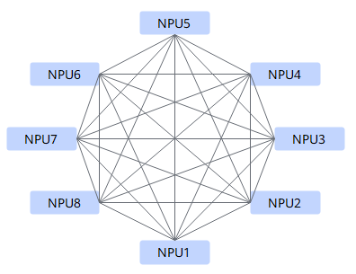

# Mesh

## 算法描述

Mesh是FullMesh互联拓扑内的基础算法，是NPU之间的全连接，任意两个NPU之间可以直接进行数据收发。

Mesh算法的实现原理为：每个NPU并发的使用多路HCCS链路从对端读取或者写入数据，使双工互联链路的双向带宽同时得到利用。

Mesh算法的时间复杂度是O\(1\)。

## 耗时计算

**表 1**  Mesh算法中各操作计算耗时

| 操作          | 耗时                             |
| ------------- | -------------------------------- |
| Scatter       | Scatter算子是单流，耗时为:  $ (p-1)(\alpha+\frac{1}{p}n\beta)=(p-1)\alpha+\frac{p-1}{p}n\beta $            |
| ReduceScatter | ReduceScatter算子是单流，耗时为：  $ (p-1)(\alpha+\frac{1}{p}n\beta+\frac{1}{p}n\gamma)=(p-1)\alpha+\frac{p-1}{p}n\beta+\frac{p-1}{p}n\gamma  $                                |
| AllGather     | Allgather算子是多流实现，耗时为：  $ (p-1)\alpha+\frac{1}{p}n\beta $                                   |