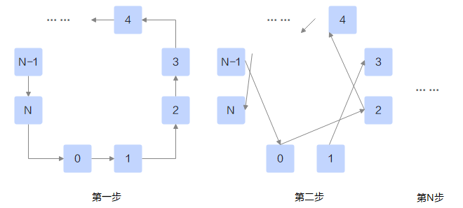

# PairWise

## 算法描述

通常每个节点只有一个RDMA网口，如果在RDMA链路上使用Mesh算法完成AllToAll，存在同时从多个节点接收数据、向多个节点发送数据的“多打多”问题，多个流在同一条链路上肆意争抢资源，可能反而导致整体性能下降。

PairWise算法是Mesh算法的分步执行版本，通过合理的规划，将通信分解成多个步骤，每一步只从一个节点接收数据、向一个节点发送数据。比如对于rankid为i的节点，第一步从\(i-1\)节点接收数据，向\(i+1\)节点发送数据；第二步从\(i-2\)节点接收数据，向\(i+2\)节点发送数据……以此类推。

## 耗时计算

定义节点i需要给节点j发送的数据大小为nij。

对于第k步，节点i发送大小为ni,i+k的数据给节点i+k，则第k步的耗时为$\alpha+\beta \cdot \underset{i}{\max}(n_{i,i+k}) $。
那么，完成整个PairWise的耗时为$(p-1)\alpha + \beta\cdot\underset{k}{\Sigma}\underset{i}{\max}(n_{i,i+k})$。

