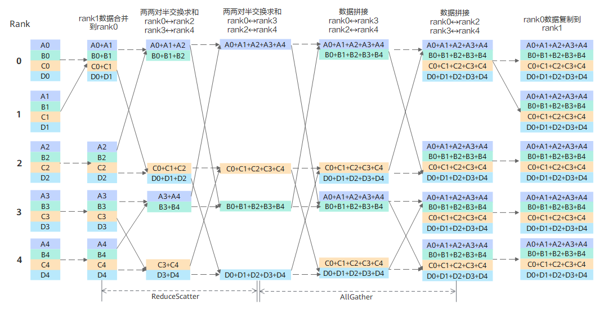

# RHD

## 算法描述

当组网增大时，例如增大至4K个rank的场景，Mesh很难组成4K个rank的全连接网络（全连接一个时钟周期就可以完成操作），且资源开销（链路资源，交换资源，同步资源）太大，还可能存在算力和资源开销不匹配的问题。Ring在这种情况下虽然节省资源（只用左手卡和右手卡进行一次收发），但是环内要做太多次，流转太慢。大型规模集群运算有服务器内数据量庞大、Ring环极长的特点，Ring的这种切分数据块的方式就不再占优势。

RHD（Recursive Halving-Doubling）算法通过递归加倍及递归折半方式完成NPU间的数据交换，相对Mesh资源消耗较小，相对Ring效率会更高。

RHD算法的实现流程如上图所示，假设有5（22+1）个rank，首先将rank1的数据合并到rank0，变成4（22）个rank，然后将这4个rank的数据两两对半交换数据并求和，即ReduceScatter操作。下一阶段，将这4个rank的数据两两拼接，即AllGather操作。最后，将rank0的数据复制到rank1，至此每个rank都具有所有rank的全量数据之和。

RHD算法同样适用于“星型”或“胖树”拓扑互联，算法的时间复杂度是$\lceil log_{2}N \rceil$。

## 耗时计算

Recursive Havling-Doubling为递归二分和倍增算法，对于2的整数次幂，使用Vector/Distance Havling/Doubling策略，对于非2的整数次幂，划分为2r（part1）和p-2r两部分（$r=p-2^{\lfloor log(p)  \rfloor} $），先将part1部分合并为r，使得剩余的rank之和为p-r（block），再执行2的整数次幂的HD（Havling-Doubling）算法，最后再在part1部分恢复出2r，得到最终结果。

**表 1**  Recursive Havling-Doubling算法中各操作计算耗时

| 操作          | 耗时                                                         |
| ------------- | ------------------------------------------------------------ |
| Broadcast     | 根据root rank的奇偶，决定part1部分参与block的为奇数rank还是偶数rank，在block内先执行Distance Havling，再向剩余rank发送一次，总耗时为：  $ \lceil log(p) \rceil(\alpha+n\beta)  $ |
| ReduceScatter | 使用Vector Doubling + Distance Havling（保证Scatter的顺序）。  2的整数次幂时 ，耗时计算公式为：  $ log(p)\alpha+\frac{p-1}{p}n\beta+\frac{p-1}{p}n\gamma $    非2的整数次幂时 ：  第一步（Reduce）： $\alpha+n\beta+n\gamma$   第二步（非均匀分片的ReduceScatter，某些rank持有2份数据），需要做$k=\lfloor log(p) \rfloor$次通信，每次交换的最大数据量为：$n_i=\lceil \frac{p}{2^{k-i+1}} \rceil\frac{n}{p}\quad i=1,2,...k$，总耗时为：  $\sum_{i=1}^{k}(\alpha+\frac{1}{p}\lceil \frac{p}{2^i} \rceil n\beta+\frac{1}{p}\lceil \frac{p}{2^i} \rceil n\gamma)=\lfloor log(p) \rfloor\alpha+\frac{n\beta}{p}\sum_{i=1}^{k}\lceil \frac{p}{2^i} \rceil+\frac{n\gamma}{p}\sum_{i=1}^{k}\lceil \frac{p}{2^i} \rceil$   该步计算比较复杂，这里尝试给出下限和上限:  下限：$k\alpha+(k+2^k-1)\frac{n\beta}{p}+(k+2^k-1)\frac{n\gamma}{p}$   上限：$k\alpha+(2^{k+1}-2)\frac{n\beta}{p}+(2^{k+1}-2)\frac{n\gamma}{p}$   第三步（Scatter）: $\alpha+\frac{1}{p}n\beta$ |
| Allgather     | 耗时同ReduceScatter，无$\gamma$相关部分。|
| Allreduce     | ReduceScatter + Allgather：这里的拆分是不完全的ReduceScatter和Allgather，不需要scatter到所有rank，并且可以采用Vector Havling + Distance Doubling（分层网络下耗时会小，但是无法保证顺序，拆分中也不需要保证顺序）。  2的整数次幂:  $ 2log(p)\alpha+2\frac{p-1}{p}n\beta+\frac{p-1}{p}n\gamma $   非2的整数次幂:  第一步（Reduce）: $\alpha+n\beta+n\gamma$  ReduceScatter: $\lfloor log(p) \rfloor\alpha+\frac{p^\prime-1}{p^\prime}n\beta+\frac{p^\prime-1}{p^\prime}n\gamma,\quad p^\prime=2^{\lfloor log(p) \rfloor}$   AllGather: $\lfloor log(p) \rfloor\alpha+\frac{p^\prime-1}{p^\prime}n\beta,\quad p^\prime=2^{\lfloor log(p) \rfloor}$   最后一步: $\alpha+n\beta$   总耗时：$ (2\lfloor log(p) \rfloor+2)\alpha+(2\frac{p^\prime-1}{p^\prime}+2)n\beta+(\frac{p^\prime-1}{p^\prime}+1)n\gamma,\quad p^\prime=2^{\lfloor log(p) \rfloor} $ |
| Reduce | 当前实现为ReduceScatter + Gather。   2的整数次幂: $2log(p)\alpha+2\frac{p-1}{p}n\beta+\frac{p-1}{p}n\gamma$   非2的整数次幂:  第一步（Reduce）: $\alpha+n\beta+n\gamma$   ReduceScatter: $\lfloor log(p) \rfloor\alpha+\frac{p^\prime-1}{p^\prime}n\beta+\frac{p^\prime-1}{p^\prime}n\gamma,\quad p^\prime=2^{\lfloor log(p) \rfloor}$   Gather: $\lfloor log(p) \rfloor\alpha+\frac{p^\prime-1}{p^\prime}n\beta,\quad p^\prime=2^{\lfloor log(p) \rfloor}$   总耗时：$(2\lfloor log(p) \rfloor+1)\alpha+(2\frac{p^\prime-1}{p^\prime}+1)n\beta+(\frac{p^\prime-1}{p^\prime}+1)n\gamma,\quad p^\prime=2^{\lfloor log(p) \rfloor}$    |
