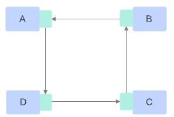

# Ring

## 算法描述

Ring算法，所有的NPU以环形相连，每张卡都有左手卡与右手卡，一个负责数据接收，一个负责数据发送，循环完成梯度累加，再循环做参数同步。

Ring算法适用于“星型”或“胖树”拓扑互联，其特点是通过Ring环将所有NPU设备的单端口双工链路串联起来。

Ring算法的时间复杂度是O\(n-1\)，n为Ring环上的NPU设备个数。

## 耗时计算

整体思路为：将所有参与的节点构成环，每个节点只和左右节点通信，如果节点数为p，则需要的通信次数为p-1，每次交换$\frac{1}{p}$的数据。

**表 1**  Ring算法中各操作计算耗时

| 操作          | 耗时                                                         |
| ------------- | ------------------------------------------------------------ |
| Scatter       | $ (p-1)(\alpha+\frac np\beta)=(p-1)\alpha+\frac {p-1}p n\beta $  |
| Gather        | $ (p-1)(\alpha+\frac np\beta)=(p-1)\alpha+\frac {p-1}p n\beta $     |
| Broadcast     | $ (p-1)(\alpha+n\beta)=(p-1)\alpha+ (p-1)n\beta $    |
| Reduce     | $ (p-1)(\alpha+n\beta + n\gamma)=(p-1)\alpha+ (p-1)n\beta +(p-1)n\gamma$                                        |
|  ReduceScatter |  $ (p-1)(\alpha+\frac{n}{p}\beta+\frac{n}{p}\gamma)=(p-1)\alpha+\frac{p-1}{p}n\beta+\frac{p-1}{p}n\gamma $  |
|  Allgather    | $ (p-1)(\alpha+\frac{n}{p}\beta)=(p-1)\alpha+\frac{p-1}{p}n\beta $  |
| AllReduce     | 实现为ReduceScatter +  Allgather:   $ 2(p-1)\alpha+2\frac{p-1}{p}n\beta+\frac{p-1}{p}n\gamma $ |
