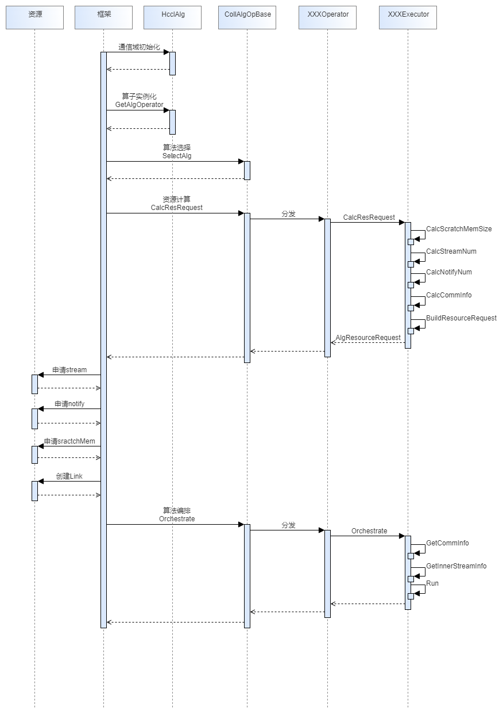

# 总体流程 

首先需要了解算子的整体执行流程：

只有完成通信域初始化后，才可以执行算子下发流程。算子流程中，框架层首先进行算子实例化，然后依次执行算法选择，资源计算，资源创建，算法编排。

开发新算子的流程为：

首先添加算子API，包括三层：单算子API，hcclComm层API，HcclCommunicator层API。然后实现一个新的Operator算子类，和若干Exector算法执行类。

