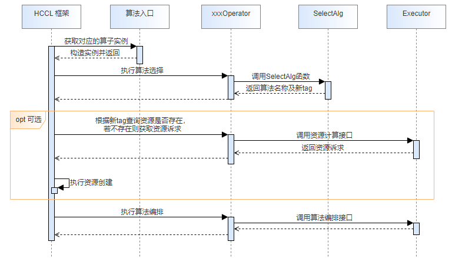
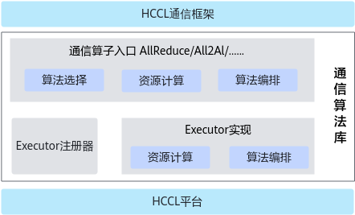
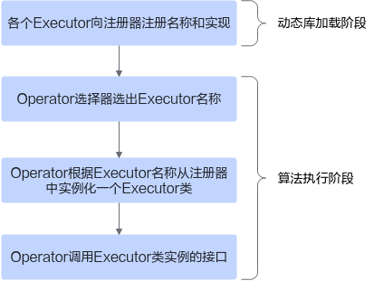

# 算法开发总体介绍 

## 通信算法执行流程<a name="section1114502816528"></a>

在开发集合通信算法之前，需要先了解通信算法的执行流程，如下图所示：



通信算法的主体执行流程可划分为4步：

1.  HCCL框架根据算子类型构造出对应的算子实例。
2.  <a name="li462871210319"></a>框架调用算子实例执行算法选择，算法选择会返回将要执行的算法名字和一个标志资源的newTag字符串。
3.  框架根据newTag查询对应的资源（适配资源可参见[适配资源计算阶段](适配资源计算阶段.md)），若不存在，则调用算子实例的资源计算接口获取算法执行需要的资源诉求，然后框架根据资源诉求将对应的资源创建出来。
4.  <a name="li1691510241237"></a>框架传入算法执行需要的资源，并执行算法编排。算法编排执行的过程中，会通过平台层的接口提交要执行的Task。

上述主体流程的[步骤2](#li462871210319)至[步骤4](#li1691510241237)，是执行一个算法的必经步骤。那么添加一个新的算法，对应也需要修改代码中的相应步骤。

## 通信算法库软件架构<a name="section117321132165314"></a>



上述是通信算法库的简化软件结构，算法库向上对接通信框架，向下调用平台层的接口。

算法库通过Operator对象来对接框架，Operator对象对框架主要提供三个接口：**算法选择 、资源计算、算法编排**。

其中算法选择的逻辑实现就在Operator对象中，资源计算和算法编排的逻辑实现在Executor中，Opeartor只是做一个分发。算法库通过Executor对象来组装算法的实现逻辑，每个算法实现对应一个Executor，Executor向注册器注册自己的算法名称和类实现。

Operator、Executor及Executor注册器之间的调用关系如下：



## Executor注册<a name="section5930182155119"></a>

算法库提供了统一的Executor注册器，不管是内置算法还是自定义算法都通过注册器向算法库进行注册。注册宏代码位于

src/domain/collective\_communication/algorithm/impl/coll\_executor/registry/coll\_alg\_exec\_registry.h

使用示例如下

```
// 第一个参数是算法名字，第二个参数用于拼接全局静态变量的名字，可与第一个参数一致，第三个参数是Executor的实现子类
REGISTER_EXEC("AllGatherComm", AllGatherComm, CollAllGatherCommExecutor);
```

## OpParam结构体介绍<a name="section473371725113"></a>

OpParam结构体设计用来承载各个算子入参信息，其成员分别为：

<a name="table15958201412115"></a>
<table><thead align="left"><tr id="row18958414101111"><th class="cellrowborder" valign="top" width="22.662266226622663%" id="mcps1.1.4.1.1"><p id="p9958614111110"><a name="p9958614111110"></a><a name="p9958614111110"></a>成员</p>
</th>
<th class="cellrowborder" valign="top" width="18.421842184218423%" id="mcps1.1.4.1.2"><p id="p89581614131117"><a name="p89581614131117"></a><a name="p89581614131117"></a>类型</p>
</th>
<th class="cellrowborder" valign="top" width="58.91589158915891%" id="mcps1.1.4.1.3"><p id="p17958114121116"><a name="p17958114121116"></a><a name="p17958114121116"></a>说明</p>
</th>
</tr>
</thead>
<tbody><tr id="row159588144119"><td class="cellrowborder" valign="top" width="22.662266226622663%" headers="mcps1.1.4.1.1 "><p id="p188844111680"><a name="p188844111680"></a><a name="p188844111680"></a>tag</p>
</td>
<td class="cellrowborder" valign="top" width="18.421842184218423%" headers="mcps1.1.4.1.2 "><p id="p1995961417119"><a name="p1995961417119"></a><a name="p1995961417119"></a>字符串</p>
</td>
<td class="cellrowborder" valign="top" width="58.91589158915891%" headers="mcps1.1.4.1.3 "><p id="p10105143741311"><a name="p10105143741311"></a><a name="p10105143741311"></a>算子在通信域中的标记，用于维测功能。</p>
</td>
</tr>
<tr id="row11959101412112"><td class="cellrowborder" valign="top" width="22.662266226622663%" headers="mcps1.1.4.1.1 "><p id="p17911183712817"><a name="p17911183712817"></a><a name="p17911183712817"></a>stream</p>
</td>
<td class="cellrowborder" valign="top" width="18.421842184218423%" headers="mcps1.1.4.1.2 "><p id="p9959121413116"><a name="p9959121413116"></a><a name="p9959121413116"></a>流对象</p>
</td>
<td class="cellrowborder" valign="top" width="58.91589158915891%" headers="mcps1.1.4.1.3 "><p id="p19959191421113"><a name="p19959191421113"></a><a name="p19959191421113"></a>算子执行的主流。</p>
</td>
</tr>
<tr id="row17381182171416"><td class="cellrowborder" valign="top" width="22.662266226622663%" headers="mcps1.1.4.1.1 "><p id="p723154799"><a name="p723154799"></a><a name="p723154799"></a>inputPtr</p>
</td>
<td class="cellrowborder" valign="top" width="18.421842184218423%" headers="mcps1.1.4.1.2 "><p id="p1032020159913"><a name="p1032020159913"></a><a name="p1032020159913"></a>void*</p>
</td>
<td class="cellrowborder" valign="top" width="58.91589158915891%" headers="mcps1.1.4.1.3 "><p id="p1538152171410"><a name="p1538152171410"></a><a name="p1538152171410"></a>输入内存的指针，默认为nullptr。</p>
</td>
</tr>
<tr id="row12744122511144"><td class="cellrowborder" valign="top" width="22.662266226622663%" headers="mcps1.1.4.1.1 "><p id="p1470192121018"><a name="p1470192121018"></a><a name="p1470192121018"></a>outputPtr</p>
</td>
<td class="cellrowborder" valign="top" width="18.421842184218423%" headers="mcps1.1.4.1.2 "><p id="p485144551714"><a name="p485144551714"></a><a name="p485144551714"></a>void*</p>
</td>
<td class="cellrowborder" valign="top" width="58.91589158915891%" headers="mcps1.1.4.1.3 "><p id="p1274582517146"><a name="p1274582517146"></a><a name="p1274582517146"></a>输出内存的指针，默认为nullptr。</p>
</td>
</tr>
<tr id="row117281642101018"><td class="cellrowborder" valign="top" width="22.662266226622663%" headers="mcps1.1.4.1.1 "><p id="p776028101118"><a name="p776028101118"></a><a name="p776028101118"></a>reduceType</p>
</td>
<td class="cellrowborder" valign="top" width="18.421842184218423%" headers="mcps1.1.4.1.2 "><p id="p1972917429105"><a name="p1972917429105"></a><a name="p1972917429105"></a>枚举值</p>
</td>
<td class="cellrowborder" valign="top" width="58.91589158915891%" headers="mcps1.1.4.1.3 "><p id="p16729134210102"><a name="p16729134210102"></a><a name="p16729134210102"></a>表示reduce类型，默认为HCCL_REDUCE_RESERVED</p>
</td>
</tr>
<tr id="row219064661011"><td class="cellrowborder" valign="top" width="22.662266226622663%" headers="mcps1.1.4.1.1 "><p id="p11274181971213"><a name="p11274181971213"></a><a name="p11274181971213"></a>syncMode</p>
</td>
<td class="cellrowborder" valign="top" width="18.421842184218423%" headers="mcps1.1.4.1.2 "><p id="p1190154617103"><a name="p1190154617103"></a><a name="p1190154617103"></a>枚举值</p>
</td>
<td class="cellrowborder" valign="top" width="58.91589158915891%" headers="mcps1.1.4.1.3 "><p id="p1319044631016"><a name="p1319044631016"></a><a name="p1319044631016"></a>表示同步模式，默认为DEFAULT_TIMEWAITSYNCMODE</p>
</td>
</tr>
<tr id="row10939144912107"><td class="cellrowborder" valign="top" width="22.662266226622663%" headers="mcps1.1.4.1.1 "><p id="p842545113126"><a name="p842545113126"></a><a name="p842545113126"></a>root</p>
</td>
<td class="cellrowborder" valign="top" width="18.421842184218423%" headers="mcps1.1.4.1.2 "><p id="p14939349141018"><a name="p14939349141018"></a><a name="p14939349141018"></a>无符号整型</p>
</td>
<td class="cellrowborder" valign="top" width="58.91589158915891%" headers="mcps1.1.4.1.3 "><p id="p1293924911100"><a name="p1293924911100"></a><a name="p1293924911100"></a>表示root节点的RankId，默认值为INVALID_VALUE_RANKID，用于Reduce、Scatter和BroadCast算子。</p>
</td>
</tr>
<tr id="row16921053101012"><td class="cellrowborder" valign="top" width="22.662266226622663%" headers="mcps1.1.4.1.1 "><p id="p7955174361313"><a name="p7955174361313"></a><a name="p7955174361313"></a>dstRank</p>
</td>
<td class="cellrowborder" valign="top" width="18.421842184218423%" headers="mcps1.1.4.1.2 "><p id="p1921953151018"><a name="p1921953151018"></a><a name="p1921953151018"></a>无符号整型</p>
</td>
<td class="cellrowborder" valign="top" width="58.91589158915891%" headers="mcps1.1.4.1.3 "><p id="p17921105313104"><a name="p17921105313104"></a><a name="p17921105313104"></a>表示目的RankId，用于Send/Recv算子。</p>
</td>
</tr>
<tr id="row15608175731013"><td class="cellrowborder" valign="top" width="22.662266226622663%" headers="mcps1.1.4.1.1 "><p id="p106085574106"><a name="p106085574106"></a><a name="p106085574106"></a>srcRank</p>
</td>
<td class="cellrowborder" valign="top" width="18.421842184218423%" headers="mcps1.1.4.1.2 "><p id="p10608205741019"><a name="p10608205741019"></a><a name="p10608205741019"></a>无符号整型</p>
</td>
<td class="cellrowborder" valign="top" width="58.91589158915891%" headers="mcps1.1.4.1.3 "><p id="p116082570105"><a name="p116082570105"></a><a name="p116082570105"></a>表示源RankId，用于Send/Recv算子。</p>
</td>
</tr>
<tr id="row129972013117"><td class="cellrowborder" valign="top" width="22.662266226622663%" headers="mcps1.1.4.1.1 "><p id="p142851328161510"><a name="p142851328161510"></a><a name="p142851328161510"></a>count</p>
</td>
<td class="cellrowborder" valign="top" width="18.421842184218423%" headers="mcps1.1.4.1.2 "><p id="p149988018110"><a name="p149988018110"></a><a name="p149988018110"></a>无符号长整型</p>
</td>
<td class="cellrowborder" valign="top" width="58.91589158915891%" headers="mcps1.1.4.1.3 "><p id="p1499860101116"><a name="p1499860101116"></a><a name="p1499860101116"></a>表示输入数据的个数。</p>
</td>
</tr>
<tr id="row10554131761511"><td class="cellrowborder" valign="top" width="22.662266226622663%" headers="mcps1.1.4.1.1 "><p id="p148651626166"><a name="p148651626166"></a><a name="p148651626166"></a>dataType</p>
</td>
<td class="cellrowborder" valign="top" width="18.421842184218423%" headers="mcps1.1.4.1.2 "><p id="p20554217191516"><a name="p20554217191516"></a><a name="p20554217191516"></a>枚举值</p>
</td>
<td class="cellrowborder" valign="top" width="58.91589158915891%" headers="mcps1.1.4.1.3 "><p id="p165545170157"><a name="p165545170157"></a><a name="p165545170157"></a>表示输入数据的类型。</p>
</td>
</tr>
</tbody>
</table>

本章接下来介绍针对已有的算子类型，扩充其实现算法的详细步骤。

