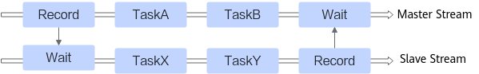
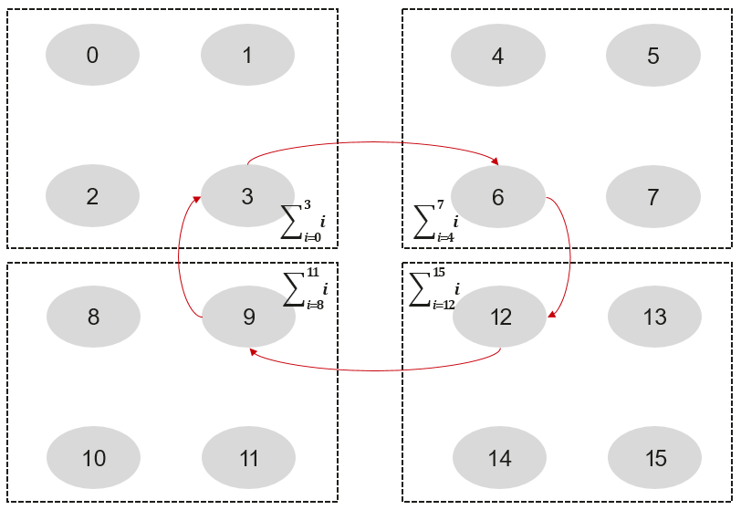
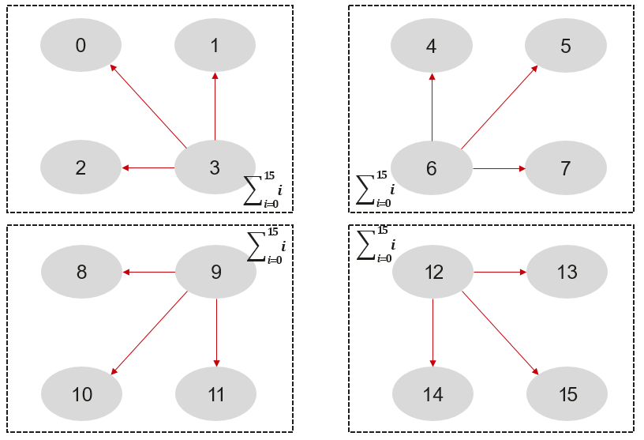
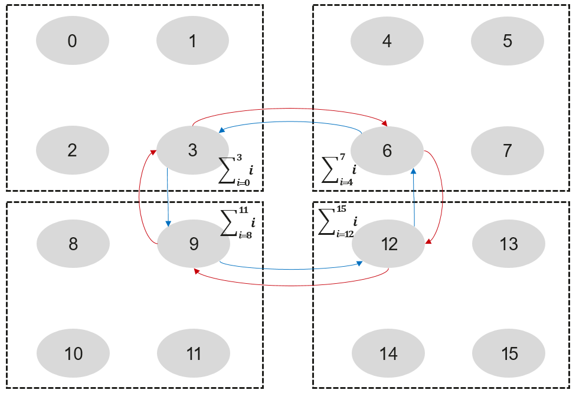

# 背景知识 

为了您有更好的阅读体验，了解集合通信算法定制开发流程前，请先了解以下概念。

## 流/主从流概念<a name="section1966725241513"></a>

流（Stream）是一种硬件资源，承载了待执行的Task序列。Task可以是一个DMA操作、一个同步处理或者一个NPU算子等。流上的Task序列按顺序执行。流之间通过Record/Wait这两个匹配的Task进行同步。



每个算子执行的入口会传入一个Stream对象，我们将算子参数传入的Stream对象称为主流，算子执行过程中申请的其他的Stream对象称为从流。主流通过Record通知从流开始执行任务，从流执行完成后，通过Record通知主流任务执行完成。主从流之间没有依赖关系时，Task可并行执行，如上图主流的TaskA、TaskB和从流的TaskX、TaskY可能是并行执行的。

AllReduce算子的执行入口HcclAllReduce接口定义如下所示：

```
// 参数传入的stream是主流
HcclResult HcclAllReduce(void *sendBuf, void *recvBuf, uint64_t count, HcclDataType dataType,
                           HcclReduceOp op, HcclComm comm, aclrtStream stream)
```

## 通信域、算法分层、子通信域的概念<a name="section45991022161616"></a>


有一个4\*4的通信域，如上图所示，其中一个方框表示一个server，一个server内有4个rank，rank编号从0到15，这边的0-15的rank编号我们称之为userRank。userRank是指rank在通信域中的编号。

接下来我们在这个4\*4的通信域上演示一个2层的AllReduce算法，Reduce类型为SUM。这边按照server内和server间进行分层，server内有一个子通信域，server间有一个子通信域。

1.  首先在server内执行Reduce操作。

    

2.  server间执行ring算法的AllReduce。

    

3.  server内执行BroadCast。

    

三步执行完成之后，4\*4的AllReduce执行完成，每个rank上都获取了0\~15共16个rank的所有数据。

其中第二步执行server间算法时使用了一个ring环。这边可以进一步优化，将链路的另一个方向也利用起来，组成两个ring环，待传输的数据一分为二在两个ring环上分别进行传输，此时server间这一层存在两个子通信域。在子通信域内，每个rank有一个子通信域内的编号，称为subCommRank，比如这边的3、6、9、12四个userRank对应的subCommRank分别是0、1、2、3。



