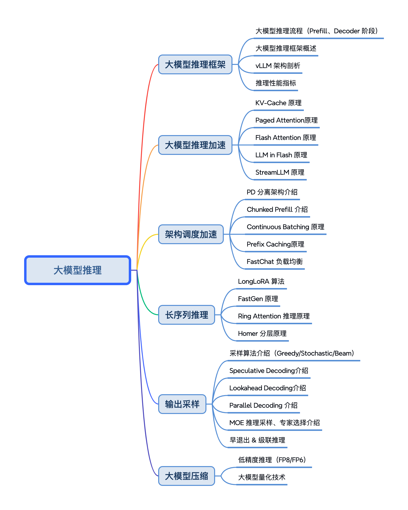

<!--Copyright © ZOMI 适用于[License](https://github.com/chenzomi12/AIFoundation/)版权许可-->

# 大模型推理

大模型推理核心工作是优化模型推理，实现推理加速，其中模型推理最核心的部分是Transformer Block。本节会重点探讨大模型推理的算法、调度策略和输出采样等相关算法。 

## 课程简介

- [**《大模型推理框架》**](./01Foundation/)：大模型推理引擎相关技术主要包括vLLM、SG-Lang、Mooncake等。这些引擎通过优化内存管理、计算效率和并行计算能力，提升了大模型的推理速度和吞吐量。重点以 vLLM 作为例子，深入地介绍大模型推理框架的底层细节和逻辑架构。

- [**《大模型推理加速》**](./02SpeedUp/)：大模型推理加速技术主要包括KV Cache 优化、并行推理、 Paged Attention、LLM in Flash、Flash Attention。这些技术共同目标是在保证计算精度的同时，提升大模型推理的速度和降低资源消耗。

- [**《大模型调度加速》**](./03Dispatch/)：大模型调度通过从宏观层面加速通过优化算法、硬件资源利用、通信架构和内存管理，提升了模型的推理速度和效率。具体包括利用通信数据量化压缩等技术减少显存碎片化，以及智能调度实现 PD 分离，从而提高大模型服务的吞吐量和降低作业完成时间。

- [**《长序列推理》**](./04LongSeq/): 大模型长序列推理通过优化 Attention 和内存管理，如 Star Attention、Continuous Batching 和 Paged Attention，提高计算效率和内存利用率，使得处理数百万标记的上下文成为可能，同时保持模型的准确性和推理速度。

- [**《输出采样》**](./05Sampling/)：大模型输出采样涉及多种策略以控制文本生成的多样性和质量，包括Beam Search、Top-K、Top-P（Nucleus）采样和 Temperature 采样等。这些方法通过不同的概率分布选择机制，平衡生成速度、准确性和文本多样性，适用于不同的大模型应用场景。

- [**《大模型压缩》**](./06Quantize/)：大模型压缩技术主要包括量化和低精度格式，旨在减少模型参数和计算复杂度，以适应资源受限环境。这些技术通过降低模型大小、提高推理速度和减少能耗，使得大模型能够在端测设备中高效运行。

希望这个系列能够给朋友们带来一些帮助，也希望 ZOMI 能够继续坚持完成所有内容哈！欢迎您也参与到这个开源课程的贡献！

## 课程脑图

## 备注

文字课程开源在 [AISys](https://chenzomi12.github.io/)，系列视频托管[B 站](https://space.bilibili.com/517221395)和[油管](https://www.youtube.com/@ZOMI666/videos)，PPT 开源在[github](https://github.com/chenzomi12/AIFoundation/)，欢迎取用！！！

> 非常希望您也参与到这个开源课程中，B 站给 ZOMI 留言哦！
> 
> 欢迎大家使用的过程中发现 bug 或者勘误直接提交代码 PR 到开源社区哦！
>
> 欢迎大家使用的过程中发现 bug 或者勘误直接提交 PR 到开源社区哦！
>
> 请大家尊重开源和 ZOMI 的努力，引用 PPT 的内容请规范转载标明出处哦！