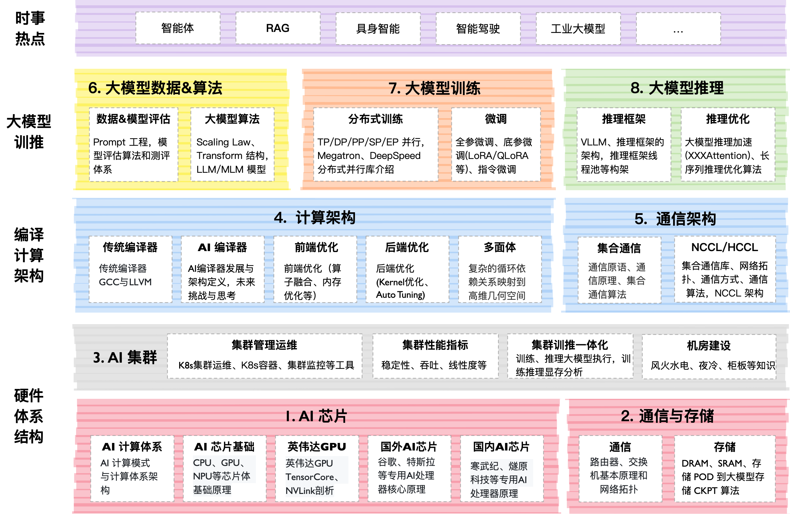

# AIFoundation

## 课程背景

聚焦 **AI Foundation**，大模型系统。大模型是基于 AI 集群的全栈软硬件性能优化，通过最小的每一块 AI 芯片组成的 AI 集群，编译器使能到上层的 AI 框架，训练过程需要分布式并行、集群通信等算法支持，而且在大模型领域最近持续演进如智能体等新技术。

## 课程内容大纲

课程主要包括以下模块，内容陆续更新中，欢迎贡献：

| 教程内容            | 简介                                                                                                | 地址                           |
| --------------- | ------------------------------------------------------------------------------------------------- | ---------------------------- |
| 01. AI 芯片原理(完结) | AI 芯片主要介绍 AI 的硬件体系架构，包括从芯片基础到 AI 芯片的原理与架构，芯片设计需要考虑 AI 算法与编程体系，以应对 AI 快速的发展。                       | [[Slides](./01AIChip/)]      |
| 02. 通信&存储       | 大模型训练和推理的过程中都严重依赖于网络通信，因此会重点介绍通信原理、网络拓扑、组网方案、高速互联通信的内容。存储则是会从节点内的存储到存储 POD 进行介绍。                  | [[Slides](./02StorComm/)]    |
| 03. AI 集群       | 大模型虽然已经慢慢在端测设备开始落地，但是总体对云端的依赖仍然很重很重，AI 集群会介绍集群运维管理、集群性能、训练推理一体化拓扑流程等内容。                           | [[Slides]()]                 |
| 04. 计算架构        |                                                                                                   | [[Slides]()]                 |
| 05. 通信架构        | 通信架构主要是指各种类型的 XCCL 集合通信库，大模型在推理的PD 分离和分布式训练，都对集合通信库有很强烈的诉求，网络模型的参数需要相互传递，因此 XCCL 极大帮助大模型更好地训练和推理。 | [[Slides](./05XCCL/)]        |
| 06. 大模型算法       |                                                                                                   | [[Slides]()]                 |
| 07. 大模型训练       |                                                                                                   | [[Slides]()]                 |
| 08. 大模型推理       |                                                                                                   | [[Slides]()]                 |
| 09. 大模型热点技术剖析   | 当前大模型技术已进入快速迭代期。这一时期的显著特点就是技术的更新换代速度极快，新算法、新模型层出不穷。因此本节内容将会紧跟大模型的时事内容，进行深度技术分析。                   | [[Slides](./09Newsletters/)] |

## 备注

> 这个仓已经到达疯狂的 10G 啦（ZOMI 把所有制作过程、高清图片都原封不动提供），如果你要 git clone 会非常的慢，因此建议优先到  [Releases · chenzomi12/AIFoundation](https://github.com/chenzomi12/AIFoundation/releases) 来下载你需要的内容

> 非常希望您也参与到这个开源课程中，B 站给 ZOMI 留言哦！
> 
> 欢迎大家使用的过程中发现 bug 或者勘误直接提交代码 PR 到开源社区哦！
> 
> 请大家尊重开源和 ZOMI 的努力，引用 PPT 的内容请规范转载标明出处哦！