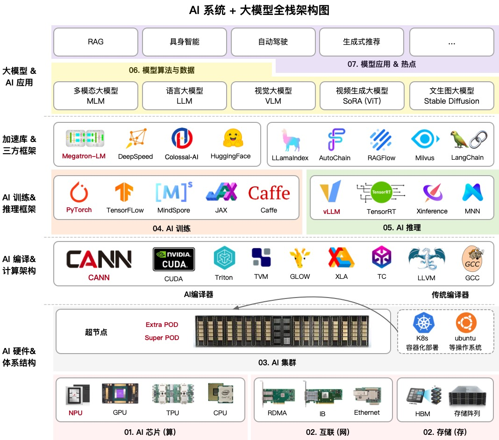

# AIFoundation

文字课程内容正在一节节补充更新，尽可能抽空继续更新正在 [AIFoundation](https://github.com/chenzomi12/AIFoundation/)，希望您多多鼓励和参与进来！！！

文字课程开源在 [AISys](https://chenzomi12.github.io/)，系列视频托管[B 站 ZOMI 酱](https://space.bilibili.com/517221395)和[油管 ZOMI6222](https://www.youtube.com/@zomi6222/videos)，PPT 开源在 [AIFoundation](https://github.com/chenzomi12/AIFoundation/)，欢迎取用！！！

## 课程背景

这个开源项目英文名字叫做**AIFoundation**，中文名字叫做**大模型系统**。大模型是基于 AI 集群的全栈软硬件性能优化，通过最小的每一块 AI 芯片组成的 AI 集群，编译器使能到上层的 AI 框架，训练过程需要分布式并行、集群通信等算法支持，而且在大模型领域最近持续演进如智能体等新技术。

本开源课程主要是跟大家一起探讨和学习人工智能、深度学习的系统设计，而整个系统是围绕着 ZOMI 在工作当中所积累、梳理、构建 AI 大模型系统全栈的内容。希望跟所有关注 AI 开源课程的好朋友一起探讨研究，共同促进学习讨论。

## 课程内容大纲

课程主要包括以下模块，内容陆续更新中，欢迎贡献：

| 序列 | 教程内容 | 简介 | 地址 | 状态 |
| --- | --------------- | ------------------------------------------------------------------------------------------------- | ---------------------------- | ---- |
| 01 | AI 芯片原理 | AI 芯片主要介绍 AI 的硬件体系架构，包括从芯片基础到 AI 芯片的原理与架构，芯片设计需要考虑 AI 算法与编程体系，以应对 AI 快速的发展。 | [[Slides](./01AIChip/)] | DONE |
| 02 | 通信与存储 | 大模型训练和推理的过程中都严重依赖于网络通信，因此会重点介绍通信原理、网络拓扑、组网方案、高速互联通信的内容。存储则是会从节点内的存储到存储 POD 进行介绍。 | [[Slides](./02StorComm/)] | DONE |
| 03 | AI 集群 | 大模型虽然已经慢慢在端测设备开始落地，但是总体对云端的依赖仍然很重很重，AI 集群会介绍集群运维管理、集群性能、训练推理一体化拓扑流程等内容。 | [[Slides](./03AICluster/)] | 待更 |
| 04 | 大模型训练 | 大模型训练是通过大量数据和计算资源，利用 Transformer 架构优化模型参数，使其能够理解和生成自然语言、图像等内容，广泛应用于对话系统、文本生成、图像识别等领域。 | [[Slides](./04Train/)] | 更新中 |
| 05 | 大模型推理 | 大模型推理核心工作是优化模型推理，实现推理加速，其中模型推理最核心的部分是Transformer Block。本节会重点探讨大模型推理的算法、调度策略和输出采样等相关算法。 | [[Slides](./05Infer/)] | 更新中 |
| 06 | 大模型算法 | Transformer起源于NLP领域，近期统治了 CV/NLP/多模态的大模型，我们将深入地探讨 Scaling Law 背后的原理。在大模型算法背后数据和算法的评估也是核心的内容之一，如何实现 Prompt 和通过 Prompt 提升模型效果。 | [[Slides](./06AlgoData/)] | 更新中 |
| 07 | 热点技术剖析 | 当前大模型技术已进入快速迭代期。这一时期的显著特点就是技术的更新换代速度极快，新算法、新模型层出不穷。因此本节内容将会紧跟大模型的时事内容，进行深度技术分析。 | [[Slides](./07News/)] | DONE |

## 课程细节

## 课程设立目的

本课程主要为本科生高年级、硕博研究生、AI 大模型系统从业者设计，帮助大家：

1. 完整了解 AI 的计算机系统架构，并通过实际问题和案例，来了解 AI 完整生命周期下的系统设计。

2. 介绍前沿系统架构和 AI 相结合的研究工作，了解主流框架、平台和工具来了解 AI 大模型系统。

## 课程部分

### **[01. AI 芯片原理](./01AIChip/)**

完结

| 编号  | 名称       | 具体内容      |
|:---:|:----- |:--- |
| 1      | [AI 计算体系](./01AIChip/01Foundation/) | 神经网络等 AI 技术的计算模式和计算体系架构  |
| 2      | [AI 芯片基础](./01AIChip/02ChipBase/)   | CPU、GPU、NPU 等芯片体系架构基础原理       |
| 3      | [图形处理器 GPU](./01AIChip/03GPUBase/)  | GPU 的基本原理，英伟达 GPU 的架构发展  |
| 4      | [英伟达 GPU 详解](./01AIChip/04NVIDIA/) | 英伟达 GPU 的 Tensor Core、NVLink 深度剖析 |
| 5      | [国外 AI 处理器](./01AIChip/05Abroad/)   | 谷歌、特斯拉等专用 AI 处理器核心原理  |
| 6      | [国内 AI 处理器](./01AIChip/06Domestic/)   | 寒武纪、燧原科技等专用 AI 处理器核心原理  |
| 7      | [AI 芯片黄金 10 年](./01AIChip/07Thought/)   | 对 AI 芯片的编程模式和发展进行总结  |

### **[02. 通信与存储](./02StorComm/)**

完结

| 编号  | 名称       | 具体内容      |
|:---:|:----- |:--- |
| 1      | [大模型存储](./02StorComm/01Storage/) | 数据存储、CheckPoint 梯度检查点  |
| 2      | [集合通信原理](./02StorComm/02Communicate/) | 通信域、通信算法、集合通信原语  |
| 3      | [集合通信库](./02StorComm/03CommLibrary/)   | 深入地剖析 NCCL/HCCL 实现算法、对外 API  |

### **[03. AI 集群原理](./03AICluster/)**

待更

| 编号  | 名称       | 具体内容      |
|:---:|:----- |:--- |
| 1      | [AI 超节点](./03AICluster/01POD/) | Scale Up、SuperPod、万卡集群  |
| 2      | [集群性能分析](./03AICluster/02Analysis/) | 集群性能分析，MFU、线性度等  |
| 3      | [Kubernetes](./03AICluster/03Kubernetes/) | 让集群部署容器化简单且高效  |

### **[04. 大模型训练](./04Train/)**

待更

| 编号  | 名称       | 具体内容      |
|:---:|:----- |:--- |
| 1      | [分布式并行](./04Train/01Parallel/) | TP、PP、EP、SP、DP 多维并行  |
| 2      | [PyTorch 框架](./04Train/02PyTorch/) | PyTorch 框架原理和昇腾适配架构  |
| 3      | [模型微调与后训练](./04Train/03Finetune/) | 大模型微调 SFT 与后训练 Post-Training  |

### **[05. 大模型推理](./05Infer/)**

待更

| 编号  | 名称       | 具体内容      |
|:---:|:----- |:--- |
| 1      | [大模型推理框架](./05Infer/01Foundation) | 推理框架整体架构，如 vLLM、SGLang |
| 2      | [大模型推理加速](./05Infer/02SpeedUp) |  |
| 3      | [架构调度与加速 ](./05Infer/03Dispatch) |  |
| 4      | [长序列推理](./05Infer/04LongSeq) |  |
| 5      | [输出采样](./05Infer/05Sampling) |  |
| 6      | [大模型量化与蒸馏](./05Infer/06Quantize) |  |

### **[06. 大模型算法](./06AlgoData/)**

待更

| 编号  | 名称       | 具体内容      | 状态      |
|:---:|:---:|:---:|:---:|
| 1      | [Transformer 架构](./06AlgoData/01Basic) | Transformer 架构原理介绍 | 待更 |
| 2      | [ChatGPT 解读](./06AlgoData/02ChatGPT) | GPT 和 ChatGPT 深度解读 | DONE |
| 3      | [大模型新架构 ](./06AlgoData/03NewArch) | SSM、MMABA、RWKV 等新大模型结构 | 待更 |
| 4      | [向量数据库](./06AlgoData/04VectorDB) | 相似性搜索、相似性度量与大模型结合 | DONE |
| 5      | [数据工程](./06AlgoData/05DataEngine) | 数据工程、Prompt Engine 等技术 | 待更 |
| 6      | [新算法解读](./06AlgoData/06NewModel) | Llama3、DeepSeek V3/R1 深度解读 | 持续 |

### **[07. 热点技术剖析](./07News/)**

基本完结，根据时事热点不定期更新

| 编号  | 名称       | 具体内容      | 状态      |
|:---:|:---:|:---:|:---:|
| 1      | [时事热点](./07News/00Others/)   |  OpenAI o1、WWDC 大会技术洞察   | 持续 |
| 2      | [AI智能体](./07News/01Agent/)   | AI Agent 智能体的原理、架构   | DONE |
| 3      | [自动驾驶](./07News/02AutoDrive/)   |  端到端自动驾驶和萝卜快跑  | DONE |
| 4      | [具身智能](./07News/03Embodied/)   |  具身智能的原理、架构和产业思考  | DONE |
| 5      | [生成推荐](./07News/04Remmcon/)   |  推荐领域的革命发展历程  | DONE |
| 6      | [隐私计算](./07News/05Computer/)   |  发展过程与 Apple 引入隐私计算  | DONE |
| 7      | [AI 十年](./07News/06History/)   |  AI 过去十年的重点事件回顾  | DONE |

## 知识清单

## 备注

> 这个仓已经到达疯狂的 10G 啦（ZOMI 把所有制作过程、高清图片都原封不动提供），如果你要 git clone 会非常的慢，因此建议优先到  [Releases · chenzomi12/AIFoundation](https://github.com/chenzomi12/AIFoundation/releases) 来下载你需要的内容

> 非常希望您也参与到这个开源课程中，B 站给 ZOMI 留言哦！
> 
> 欢迎大家使用的过程中发现 bug 或者勘误直接提交代码 PR 到开源社区哦！
> 
> 请大家尊重开源和 ZOMI 的努力，引用 PPT 的内容请规范转载标明出处哦！